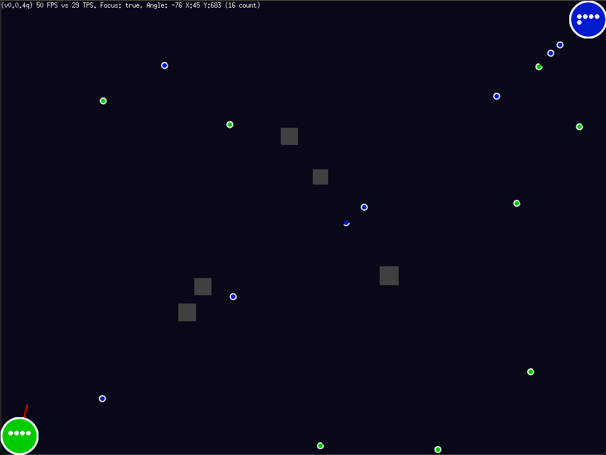

# Bouncies

A simple game experiment written in Go and Ebitengine.

This project can possibly be used as a reference to get you started with Go game development,
especially if you are interested in using the fantastic Ebitengine game engine.

IMPORTANT:  This is still very much WIP...  I'll be expanding it over the next
few weeks, schedule permitting. This is probably going to form the basis of one of my talks
in the future...

## Demo

You can play a live demo at <https://ewaldhorn.github.io/bouncies/>.

This works best on a computer, though there's support planned for tablets eventually.

## What

The number one question I've received after some of my talks (list here: <https://nofuss.co.za/about/>)
from fellow or aspiring Go developers is:  "Can I write a game with Go?".

Yup. Absolutely! Go is a general-purpose language and can most definitely be used
to write games.  A special bonus is the brilliant Ebitengine project that provides
Go with a fantastic 2D game engine that works across multiple platforms.

## Why

But why do any game development at all? It's not just fun, because game development
can challenge you in different ways. Especially when you have to do a bunch of work
really quickly to keep the framerate up! Games deal with concurrency, event sequencing,
constant data updates and user input, to name but a few things.

I often use game development to learn new strategies and techniques, because the
feedback is instant and visual.  This makes it easier to experiment and see the
effect of what I'm doing and turns dry theory into something fun and practical.

### Playing

The idea is to out-bounce your enemy with your Bouncers. You and the enemy both
have a base from where bouncers will spawn over time. A base can store up to six
bouncers, ready to be deployed.  Bases have shields which are depleted by enemy
bouncers hitting it and replenished by friendly bouncers. Shields also regenerate
over time.

### Platforms

Ebitengine supports a variety of platforms, and for this game, I am mainly using
WASM as my target platform.  Testing is often done as a desktop app and I then
also test via the browser in the WASM form.

The default `task test` command runs the game as a desktop app. It's really handy
to have different options available.

### Technologies

I used a variety of technologies to make this all happen:

| Tech         | Where                        | Why                                |
| ------------ | ---------------------------- | ---------------------------------- |
| Go           | <https://go.dev/>            | Development language of choice     |
| Ebitengine   | <https://ebitengine.org/>    | Great 2D engine, with WASM support |
| Task         | <https://taskfile.dev/>      | Build tool of choice               |
| GoLangCILint | <https://golangci-lint.run/> | Go linter for code cleanup         |

### Tasks

For convenience, I have a Task file. This helps save me from having to remember commands. Instead, Task does that for me!

Run `task` to see a list of available tasks. Some are:

| Task            | Action taken                                                                    |
| --------------- | ------------------------------------------------------------------------------- |
| buildproduction | Builds a production WASM binary, minus debug information                        |
| buildwasm       | Builds the WASM project                                                         |
| clean           | Removes the './bin/' folder                                                     |
| default         | Lists available tasks                                                           |
| lint            | Runs the 'golangci-lint' tool on the source code                                |
| run             | Runs the files in the ./bin/ folder as-is, no build steps envoked. On port 9000 |
| runwasm         | Runs the project in WASM on port 9000                                           |
| setupexecjs     | Copies the wasm_exec.js and html files to the './bin/' folder                   |
| test            | Runs the desktop project                                                        |
